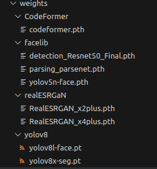

# Portrait Processing Tool

This repository introduces a sophisticated image processing tool that automatically crops to a portrait view and performs face restoration. Designed to deliver professional results with ease, the tool outputs images with a default resolution of 1024x1024 pixels.

## Features

### Automatic Portrait Cropping
- **With/Without Background**: Choose to retain or remove the background during the cropping process.
- **Face Restoration**: Enhance the cropped portrait with face restoration feature, which improves image quality.
- **Upscale**: Increase the image size without compromising on quality, perfect for high-resolution uses.
- **Mask Generation**: Automatically generate a mask for the cropped portrait, useful for further image manipulation.

### Advanced Options (Further possible implementation)

- **Object Mask Extraction**: Beyond portraits, the tool can extract masks of various objects, useful for inpainting and creative edits with stable diffusion.


## Installation

To get started, clone the repository and install the required dependencies:

```bash
pip3 install -r requirements.txt
```

## Model Weights

The model weights can be downloaded from the following SharePoint link. Please ensure you place the weights in the respective folders within the `weights` directory.

[Download Model Weights](https://brookergroup-my.sharepoint.com/:f:/p/minkhantsoe/Eoi3cb9LUe1PkOXMhvsxZjYBq_KgbC9MFEZjMGGe4P7asQ?e=xl0WRe)



## Models

### YOLOv8

For segmentation and detection tasks, we utilize the YOLOv8 models. These models are designed for high performance in a variety of computer vision applications.

For more details on YOLOv8:
[ultralytics/yolov8](https://github.com/ultralytics/ultralytics)

### CodeFormer

CodeFormer is employed for face restoration, providing high-quality results in restoring facial images.

For more information on CodeFormer:
[sczhou/CodeFormer](https://github.com/sczhou/CodeFormer)

## Usage

Run the main.py to process the program.
Edit the config.py as required for the usage.
In yolov8 instance segmentation process, only person class is considered, the rest were ignored. If you need other class, adjust as you required by referencing class index in config.py.

## Support

If you encounter any problems or have questions, please file an issue on this GitHub repository or contact me.
